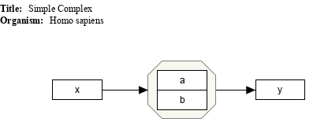
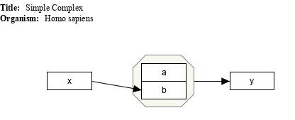

# Complex models

## Simple complex

* [GPML](SimpleComplex/simpleComplex.gpml)
* [Expected results](SimpleComplex/simpleComplex.props)

## Deep Linked complex

* [GPML](DeepLinkedComplex/deepLinkedComplex.gpml)
* [Expected results](DeepLinkedComplex/deepLinkedComplex.props)

